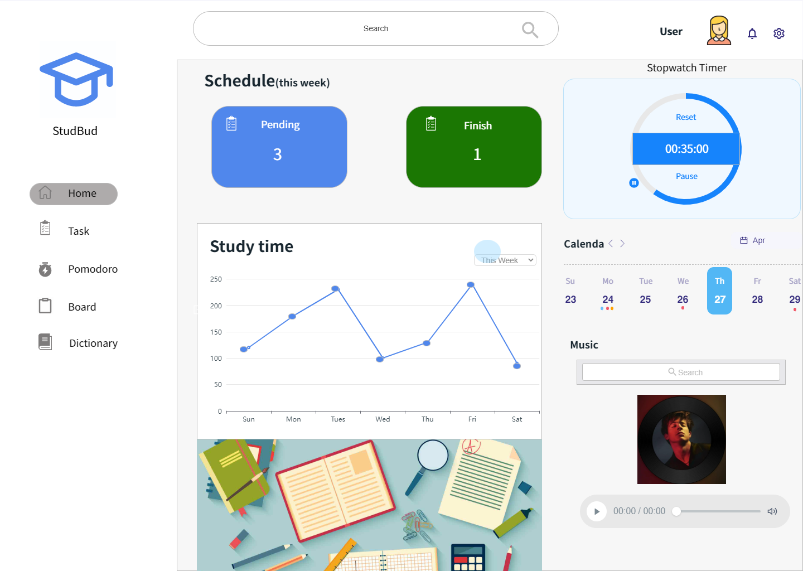

# **Assessment 3 Studbud**
With the outbreak of the COVID-19, many college students have to take online courses, and too many interference factors have caused their learning efficiency to decline. Studbud can help them improve this situation.

# **Studbud Functions**

## **1. Stopwatch Timer ＆ Music**
Each page includes a stopwatch and music function, where the user can start, stop and reset the timer. Users can also play music to relax themselves when they are irritable at work.

## **2. Task**
In the Tasks feature, users are able to enter individual tasks where they can set items such as priority, due date, estimated completion time, etc. for the task.

## **3. Pomodoro**
The Pomodoro Clock is a clock that uses the Pomodoro Technique to manage time. It can help people concentrate and improve efficiency. It is a good helper for work and study. Users can start, stop, and reset the timer with buttons, as well as edit Pomodoro and rest periods.

## **4. Board**
KanBan Broad is an agile project management tool designed to help visualize work, limit work in progress, and maximize efficiency. Users can create textual content in it, and can drag this content.

## **5. Dictionary**
In the dictionary section, users can use the dictionary to look up words that they do not know or are not sure about, and get explanations.

# **Model iteration**
Based on feedback from A2, I iterate on the mockup. I have explored many web sites and I have explored and researched the layout of these sites. By exploring I found some information, most web programs like to put the navigation bar on the left side of the page, people also prefer this layout, the left side navigation is easier to navigate, it has stronger usability in the design, it does not require the user Lookups on sight, as users will subconsciously notice their presence. I changed my mockup layout based on this information.

#### **Original Design**

#### **Final Design**

# **Explanation**
In this assessment, I used some js external libraries and APIs, they can help me complete the assessment better.

# **Reference** 
Chart - apache echarts. (n.d.). Retrieved from https://echarts.apache.org/examples/en/index.html 

Drag &amp; drop - vanilla javascript with comments - codepen. (n.d.). Retrieved from https://codepen.io/szrudi/pen/gOpLyKd 

Dictionary Public-Apis. (n.d.). Public-apis/public-apis: A collective list of Free Apis. GitHub. Retrieved from https://github.com/public-apis/public-apis#dictionaries 

HTML. HTML Standard. (2022, May 26). Retrieved from https://html.spec.whatwg.org/multipage/dnd.html#drag-and-drop-processing-model 

How to - toggle switch. How To Create a Toggle Switch. (n.d.). Retrieved from https://www.w3schools.com/howto/howto_css_switch.asp 

Trending web &amp; landing page designs. Trending Website, Landing Page and Splash Page Designs on Dribbble. (n.d.). Retrieved from https://dribbble.com/shots/popular/web-design 

👑 the #1 place for design files. UpLabs. (n.d.). Retrieved from https://www.uplabs.com/ 
